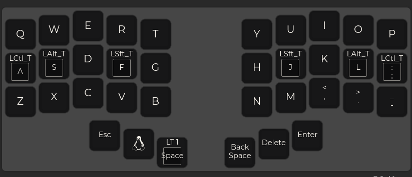
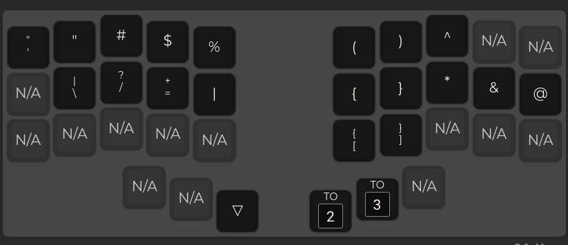
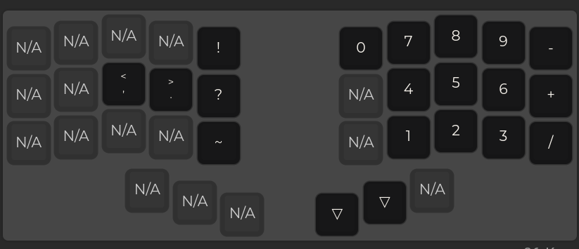
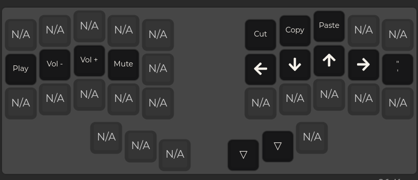

## Setup 

`pip install qmk`

## Updating keyboard firmware

- Make changes to JSON file
- `qmk import-keymap /home/sondrelg/repos/keyboard/keymap.json`
- `qmk compile -kb beekeeb/piantor -km sondre_piantor_v2`
- `qmk flash -kb beekeeb/piantor -km sondre_piantor_v2`

## Layer 0

## Layer 1 

## Layer 2 

## Layer 3
